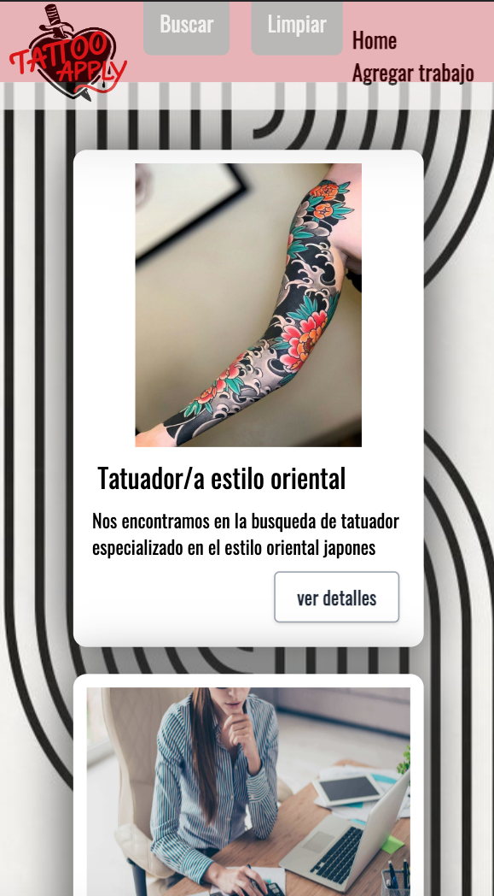

# TattooApply
----
by **Solange Aimery** 🖤

Podes ver el proyecto haciendo click [Aqui](https://solangeaimery.github.io/TpAsincronismo/index.html) 👈

##  Esta aplicacion web te ayudará a encontrar tu trabajo en el mundo del tatuaje y las modificaciones corporales.

Es 100% responsive, funciona en desktop tablet y mobile.

### Mobile 

    

Podes agregar nuevos puestos de trabajo facilmente.

Tambien podes buscar en los trabajos disponibles con nuestros filtros, podes fitrar por:
- Localidad
- Tipo (full-time, part-time, A convenir)
- Experiencia

Tambien podes editar los trabajos ya creados en caso de ser necesario!

## 🛠️ Construido por:
- JavaScript 
- [Tailwind](https://tailwindcss.com/docs/installation)
- HTML 5
- CSS

## Gracias por leer 🖤
